<h1 align="center">Shubham Sinha</h1>

  Building real-world ML systems — from fraud detection to trading automation. 
  Focused on high-impact, production-grade AI. 
  Currently exploring computer vision, deep learning, and scalable ML systems.

---

### ⚡ What I do
- 🧠 Machine Learning (focus: applied + production)
- 💰 FinTech systems (fraud detection, trading bots)
- ⚙️ Real-time systems (Kafka, streaming pipelines)
- 📊 Data → Decisions → Systems

---

### 🛠️ Tech Stack

  
  
  
  
  
  
  
  
  
  

---

### 🚀 Featured Projects
| Project | What it does | Impact |
|--------|-------------|--------|
| **[AML Platform](https://github.com/Shubham270206/aml-platform)** | Real-time transaction monitoring with ML + GNNs | 🚀 99.88% recall, explainable fraud detection |
| **[ASL Recognition](https://github.com/Shubham270206/asl-sign-language-recognition)** | Real-time sign language detection | 🤟 CV + real-time inference |
| **[Binance Futures Bot](https://github.com/Shubham270206/binance-futures-bot)** | Automated crypto trading system | 💰 API + strategy automation |
| **[RAG Chatbot](https://github.com/Shubham270206/rag-chatbot)** | Chat with PDFs using LLMs | 🧠 Retrieval + LLM pipeline |
| **[System Monitor](https://github.com/Shubham270206/system-health-monitor)** | Terminal system dashboard | ⚙️ Real-time metrics |

  

---

### 📊 GitHub Stats

  
  

  

---

### 📬 Connect

  

---

  <i>Turning data into decisions — and decisions into systems.</i>

